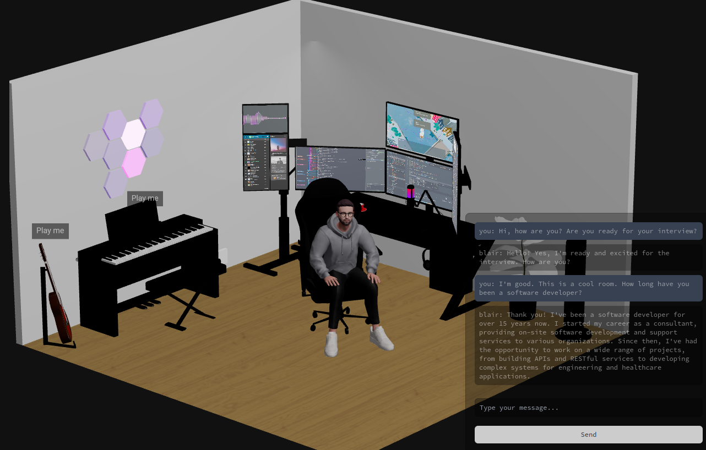

# My Office

My Office is a 3D room that allows you to interview a virtual avatar.

Featuring:

- 🧍 An avatar that can be interviewed using chat input (powered by OpenAI)
- 🔊 Avatar speech output (powered by Google Text-to-Speech API)
- 🎹 An interactive piano and guitar that can be played using your mouse.
- 🖥️ Multiple monitors displaying short videos.

The application is built using Three.js, React Fiber, and Node.js.



## 🚀 Getting Started

The application is split into two parts: the server and the client.

### 🌐 Server

The server facilitates chatting with our virtual avatar, using socket.io for real-time communication, OpenAI API for intelligent responses, and Google Cloud Platform for speech conversion.

#### Setup

1. **Google Cloud Platform**: Secure a [service account](https://cloud.google.com/docs/authentication/provide-credentials-adc#local-key) key file. Place it in the server directory as `service-account.json` and declare `GOOGLE_APPLICATION_CREDENTIALS=./service-account.json` as an environment variable.

2. **OpenAI API Key**: Sign up for an [OpenAI API Key](https://platform.openai.com/api-keys). Store your key in an environment variable named `OPENAI_API_KEY`.

3. **Assistant ID**: Create an [OpenAI Assistant](https://platform.openai.com/docs/assistants/overview) and set its ID as `OPENAI_ASSISTANT_ID` environment variable.

4. **Chat Sender**: Identify your chat sender with `SENDER_FROM` environment variable.
```bash
cd server
npm install
npm start # or npm run dev for development mode
```

### 💻 Client

The client enables the user to interact with a virtual avatar through typed chat inputs. Additionally, the user can interact with various objects within the virtual room.

#### Setup

1. Set the environment variable `NEXT_PUBLIC_SERVER_URL` to the server URL.

2. Install the client dependencies and start the client.

```bash
cd client
npm install
npm start # or npm run dev for development mode
```
